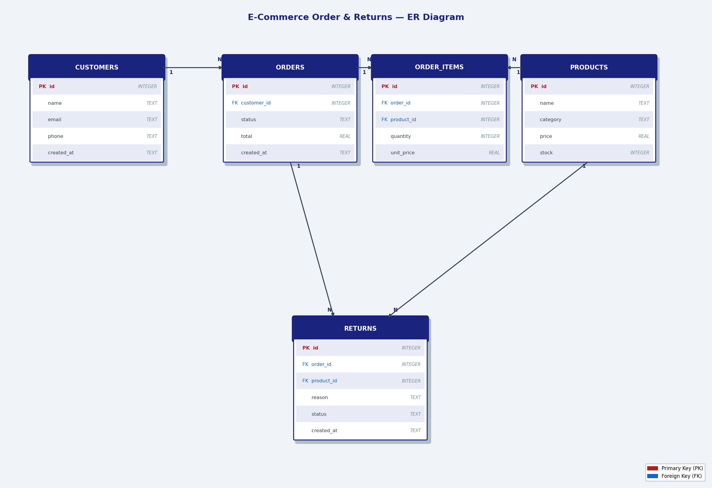

# ecommerce-sql-app

A command-line e-commerce order and returns management system backed by SQLite.

## Features

- Place orders with automatic stock deduction and total calculation
- Update order status (`pending` → `shipped` → `delivered` / `cancelled`)
- Request and manage product returns with status tracking
- View sales summary (revenue and units sold per product, excluding cancelled orders)
- Look up all orders for a specific customer
- Low stock report with configurable threshold

## Tech Stack

- **Python 3** — application logic and CLI interface
- **SQLite** — embedded relational database (`ecommerce.db`)
- No external dependencies required

## Database Schema

| Table | Description |
|---|---|
| `customers` | Customer name, email, phone |
| `products` | Product name, category, price, stock level |
| `orders` | Order linked to customer, with status and total |
| `order_items` | Line items linking orders to products |
| `returns` | Return requests linked to order + product |

ER diagram:



## Project Structure

```
ecommerce-sql-app/
├── app.py        # CLI entry point and menu logic
├── models.py     # Database connection and all SQL queries
├── schema.sql    # Table definitions
├── seed.sql      # Sample data
└── er_diagram.png
```

## Order & Return Statuses

**Orders:** `pending` → `shipped` → `delivered` | `cancelled`

**Returns:** `requested` → `approved` → `refunded` | `rejected`
